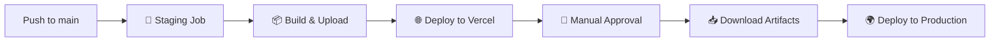

# 🚀 GitHub Actions Deployment Workflow


## 🎯 Workflow Overview

This repository includes a comprehensive GitHub Actions workflow that automates the deployment process with the following features:

### ✨ Key Features

- **🔄 Automatic Staging**: Deploys to Vercel on every push to `main`
- **🛑 Manual Production**: Requires approval before production deployment
- **📦 Artifact Reuse**: Same build deployed to both environments
- **🌐 Multi-Platform**: Vercel (staging) + Hostinger (production)
- **🔐 Secure**: Uses GitHub Secrets for sensitive data

### 🏗️ Workflow Jobs

#### 1. 🚀 Deploy to Staging

- ✅ Automatically triggered on push to `main`
- ✅ Builds Next.js static site
- ✅ Uploads build artifacts
- ✅ Deploys to Vercel for preview

#### 2. 🛑 Deploy to Production

- ✅ Requires manual approval
- ✅ Downloads build artifacts
- ✅ Deploys to Hostinger via FTP
- ✅ Uses GitHub Environments

## 🔧 Quick Setup

### 1. Required Secrets

Add these to your GitHub repository secrets:

```bash
# Vercel Deployment
VERCEL_TOKEN=your_vercel_token
VERCEL_ORG_ID=your_org_id
VERCEL_PROJECT_ID=your_project_id

# Hostinger FTP
FTP_HOST=your_ftp_host
FTP_USERNAME=your_ftp_username
FTP_PASSWORD=your_ftp_password
```

### 2. Environment Setup

Create a `production` environment in GitHub:

- Go to Settings → Environments
- Create "production" environment
- Enable "Required reviewers"

### 3. Test Locally

```bash
# Make script executable
chmod +x scripts/test-deployment.sh

# Run local test
./scripts/test-deployment.sh
```

## 📊 Deployment Process



## 🎯 Benefits

- ✅ **Zero Rebuild**: Same artifacts for staging and production
- ✅ **Safe Deployments**: Manual approval for production
- ✅ **Fast Previews**: Instant Vercel staging deployments
- ✅ **Cost Effective**: Hostinger for production hosting
- ✅ **Reliable**: Comprehensive error handling

## 🔍 Monitoring

- **Staging URL**: `https://your-project.vercel.app`
- **Production URL**: `https://your-domain.com`
- **Workflow Status**: Check Actions tab
- **Build Artifacts**: Available for 7 days

---

📖 **Detailed Setup**: See [DEPLOYMENT.md](./DEPLOYMENT.md) for complete configuration guide.

🚀 **Ready to deploy?** Push to `main` branch and watch the magic happen!
