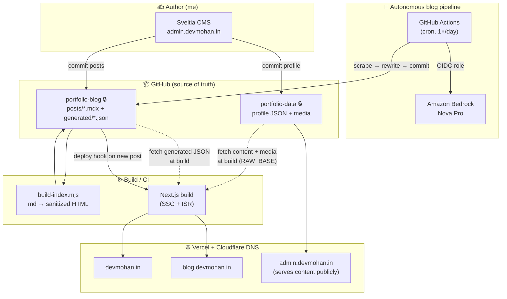
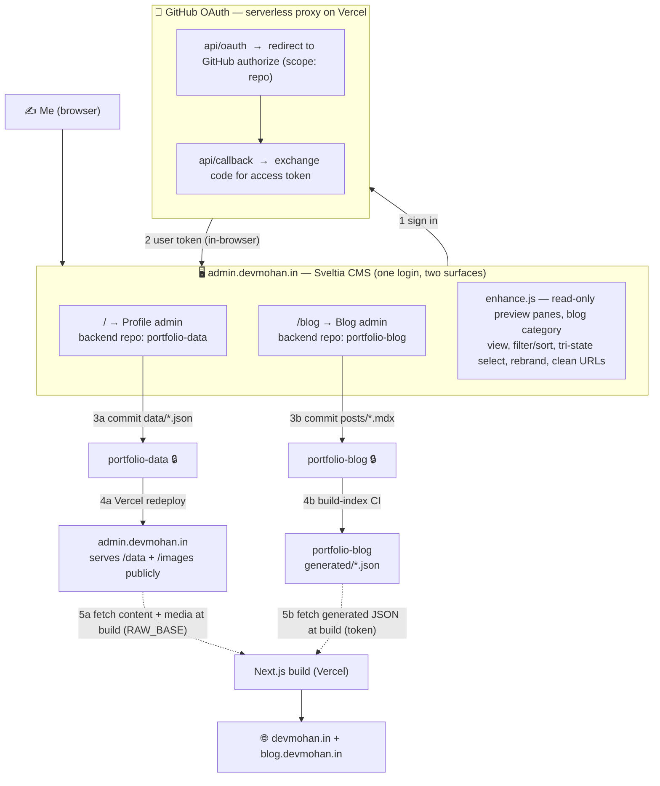

# devmohan.in — Architecture & Tooling

How the whole portfolio is built, hosted, and kept fresh — an autonomous,
AI‑written blog and a git‑based CMS on top of a static Next.js site, with **no
runtime database**.

**Live:**
[devmohan.in](https://devmohan.in) (portfolio) ·
[blog.devmohan.in](https://blog.devmohan.in) (blog) ·
[admin.devmohan.in](https://admin.devmohan.in) (CMS)

---

## System at a glance

**One‑liner:** content lives in two **private** git repos; a static Next.js app
pulls it at build time and serves the portfolio + blog; a git‑based CMS and a
daily AI pipeline are the two ways new content lands in those repos.

---

## Repositories

| Repo | Visibility | Role |
|---|---|---|
| **next-gen-portfolio** | public | The Next.js app — serves `devmohan.in` **and** `blog.devmohan.in` (host‑based routing). |
| **portfolio-data** | 🔒 private | Single source of truth for **profile** content (`data/*.json`, `images/`). Hosts the Sveltia CMS + GitHub OAuth proxy. |
| **portfolio-blog** | 🔒 private | Single source of truth for **blog posts** (`posts/*.mdx`) + precompiled `generated/*.json`. |
| **daily-dev-digest** | 🔒 private | Python pipeline that writes one new blog post per day via Amazon Bedrock. |

> Both content repos are **private**; the app still reads them at build because
> `portfolio-data`'s own Vercel deploy (`admin.devmohan.in`) serves `/data` and
> `/images` publicly, and `portfolio-blog` is read with a build‑time token.

---

## Tech stack & tools

### Frontend / app
- **Next.js 16** (App Router) + **React**
- **Tailwind CSS 3.4** + `@tailwindcss/typography`
- **Middleware** for host‑based subdomain routing (`/` ↔ `/blogs` on the blog host)
- **SSG + ISR** — content fetched at build, revalidated; **no runtime DB**
- `rehype-sanitize` + `rehype-highlight` (highlight.js) for safe post HTML

### Content management (CMS)
- **[Sveltia CMS](https://github.com/sveltia/sveltia-cms)** `0.172.1` — git‑based, drop‑in Decap successor, zero‑backend
- **GitHub OAuth** via a tiny serverless proxy (`api/oauth`, `api/callback`) on Vercel
- Custom `admin/enhance.js` — rebranding, per‑type collections, read‑only preview panes, blog category view, filter/sort, tri‑state select‑all

### Autonomous blog pipeline
- **Python** — scrape → clean → dedupe → cite → generate → verify → export
- **Amazon Bedrock — Nova Pro** (`us.amazon.nova-pro-v1:0`) via the boto3 **Converse API**
- **GitHub Actions** — `cron` 1×/day; authenticates to AWS via **OIDC role assumption** (no long‑lived keys)
- `trafilatura` (extraction) · `difflib` (dedupe)
- `build-index.mjs` — `gray-matter` frontmatter, md → **sanitized, highlighted HTML**, emits `blogs.json` / `search-index.json` / `tags.json`

### Hosting & infra
- **Vercel** — hosts the app (`devmohan.in` + `blog.devmohan.in`) and the CMS/content (`admin.devmohan.in`)
- **Cloudflare** — DNS (CNAMEs → Vercel)
- **GitHub** — repos, Actions CI, OAuth
- **AWS** — Bedrock (Nova Pro); IAM OIDC role, ~\$0.30/mo

---

## CMS deep-dive (content editing)

The CMS is **[Sveltia CMS](https://github.com/sveltia/sveltia-cms)** — a git‑based
editor with **no backend and no database**: it's just a static page that talks to
GitHub with the editor's own OAuth token and commits content directly. One login
drives **two surfaces** (profile + blog), and a custom `enhance.js` layers the
tailored UX on top.

### How it works

1. **Sign in** — clicking *Login* opens the GitHub OAuth flow. A tiny serverless
   proxy (`api/oauth` → `api/callback`, hosted on Vercel) does the code‑for‑token
   exchange; the token lives only in the editor's browser session. **Its `repo`
   scope covers both private repos, so one login edits both.**
2. **Two surfaces, two repos** — Sveltia binds one config to one repo, so the
   portal has two entry points sharing that login:
   - `admin.devmohan.in/` → **Profile** admin (backend `portfolio-data`).
   - `admin.devmohan.in/blog` → **Blog** admin (backend `portfolio-blog`).
3. **Edit = commit** — saving an entry commits straight to the private repo over
   the GitHub API (`data/*.json` for profile, `posts/*.mdx` for blog). No server,
   no draft DB.
4. **Publish** —
   - *Profile:* the commit triggers a Vercel redeploy of `portfolio-data`, whose
     site (`admin.devmohan.in`) serves `/data` and `/images` **publicly** — which
     is exactly why the content repo can stay private.
   - *Blog:* the commit triggers the `build-index` CI (see the pipeline section),
     which regenerates `generated/*.json`.
5. **App consumes** — the Next.js build pulls profile content/media from
   `admin.devmohan.in` (`RAW_BASE`) and blog JSON from `portfolio-blog` (token),
   then renders `devmohan.in` + `blog.devmohan.in`.

### `enhance.js` — the custom layer

Sveltia is customized entirely client‑side by a single script both admin pages
load, configured per page via `window.__ADMIN__`:

- **Rebrand + chrome:** replaces “Sveltia CMS” with “Dev Mohan”, sets the tab
  title, adds a same‑tab cross‑link between the two admins, and serves clean URLs
  (`/`, `/blog`) via Vercel rewrites.
- **Profile:** each content type is its own sidebar collection with a real
  sub‑item count; clicking one shows a **read‑only preview** (fetched from the
  public `/data/*.json`, List/Grid toggle) with an **Edit** button into the form.
- **Blog:** a custom **category view** — *All Posts* + categories (with counts)
  in the nav, a **filter search + sort** toolbar, a **tri‑state Select All**, and
  click‑to‑edit — driven by `blog.devmohan.in/blogs.json` (CORS‑enabled).

## Blog flow (autonomous) — step by step

The pipeline (`daily-dev-digest`) runs unattended once a day and turns a scraped
source article into a fully rewritten, fact‑checked, styled blog post that goes
live — with **two LLM calls** wrapped in deterministic Python and no human in
the loop.

```mermaid
flowchart TD
    Cron["⏰ GitHub Actions<br/>cron 30 2 * * * (8:00 AM IST)<br/>+ manual workflow_dispatch"] --> Auth

    subgraph Auth["🔐 Auth — no long-lived keys"]
        direction LR
        OIDC["OIDC → assume IAM role<br/>gha-daily-dev-digest-bedrock<br/>(bedrock:InvokeModel)"]
        PAT["BLOG_REPO_TOKEN (PAT)<br/>push to portfolio-blog"]
    end

    Auth --> Prep

    subgraph Prep["📥 Deterministic prep (Python)"]
        direction TB
        S1["1️⃣ Scrape — pull candidate dev articles from feeds"]
        S2["2️⃣ Clean — trafilatura extracts main text, strips boilerplate"]
        S3["3️⃣ Dedupe — difflib vs existing posts, drop near-duplicates"]
        S4["4️⃣ Select + cite — best candidate (MAX_TOTAL=1), keep source URL"]
        S1 --> S2 --> S3 --> S4
    end

    S4 --> LLM

    subgraph LLM["🤖 Amazon Bedrock · Nova Pro (boto3 Converse)"]
        direction TB
        L1["5️⃣ Generate — structured JSON:<br/>{title, subtitle, summary, tags, body_markdown}"]
        L2["6️⃣ Fact-verify — re-check the rewrite against the source<br/>(no fabricated claims)"]
        L1 --> L2
    end

    L2 --> Ex["7️⃣ Export — build posts/&lt;slug&gt;.mdx<br/>(frontmatter + markdown body, forced byline)"]
    Ex --> Push["8️⃣ Commit + push → portfolio-blog 🔒"]

    Push --> CI

    subgraph CI["⚙️ portfolio-blog CI (GitHub Actions)"]
        direction TB
        B1["9️⃣ build-index.mjs — gray-matter parse,<br/>md → sanitized + highlighted HTML"]
        B2["🔟 emit generated/{blogs,search-index,tags}.json + commit"]
        B3["1️⃣1️⃣ verify-safety gate (no executable/unsafe content)"]
        B1 --> B2 --> B3
    end

    B3 --> Hook["1️⃣2️⃣ Fire Vercel deploy hook (gated on change)"]
    Hook --> Rebuild["1️⃣3️⃣ Next.js rebuild — fetch generated JSON at build"]
    Rebuild --> Live["🌐 blog.devmohan.in updated"]
```

### What each step does

| # | Step | Tool | Detail |
|---|------|------|--------|
| — | **Trigger** | GitHub Actions | `cron: 30 2 * * *` (once/day) or manual `workflow_dispatch`. |
| — | **Auth** | OIDC + PAT | The job assumes an AWS IAM role via **OIDC** (short‑lived creds, no stored AWS keys) for Bedrock, and uses a GitHub PAT to push to `portfolio-blog`. |
| 1 | **Scrape** | Python | Fetch candidate articles from developer sources/feeds. |
| 2 | **Clean** | `trafilatura` | Extract the main article text, strip nav/ads/boilerplate. |
| 3 | **Dedupe** | `difflib` | Compare against already‑published posts; skip near‑duplicates. |
| 4 | **Select + cite** | Python | Pick the single best candidate (`MAX_TOTAL=1`) and record the **source URL** for attribution. |
| 5 | **Generate** | **Bedrock · Nova Pro** | One Converse call returns *structured JSON* — `title, subtitle, summary, tags, body_markdown` — an original rewrite, not a copy (`max_tokens ≈ 5000`, ~600–1000 words). |
| 6 | **Fact‑verify** | **Bedrock · Nova Pro** | A second call checks the rewritten post against the source so no claim is fabricated. |
| 7 | **Export** | Python | Assemble `posts/<slug>.mdx` — frontmatter (`title, subtitle, summary, slug, date, tags, source_url…`) + the markdown body; byline forced to “Mohan Sagar”. |
| 8 | **Commit + push** | git / PAT | Push the new `.mdx` to the private `portfolio-blog` repo. |
| 9–11 | **Index + safety** | `build-index.mjs` (CI) | `gray-matter` frontmatter parse → **sanitized, syntax‑highlighted HTML** (`rehype-sanitize` + `rehype-highlight`); emit `generated/{blogs,search-index,tags}.json`, commit them; `verify-safety.mjs` blocks unsafe content. *This runs in the content repo, so a bad post can't break the app build.* |
| 12 | **Deploy hook** | Vercel | CI fires the “Rebuild on Blog Update” Vercel hook — only when the index actually changed. |
| 13 | **Rebuild** | Next.js / Vercel | The app rebuilds, pulling the fresh `generated/*.json`, and `blog.devmohan.in` shows the new post. |

> **Why two LLM calls, not an agent?** The pipeline is intentionally
> *output‑optimized*: deterministic Python owns scraping/dedupe/citation (cheap,
> predictable), and Nova Pro is used only where a model is genuinely needed —
> **generate** then **verify**. Cost is ~\$0.30/month against a \$200 credit.

> **Model note:** Anthropic models are blocked at the account level on this AWS
> account, so the rewrite runs on **Amazon Nova Pro** (`us.amazon.nova-pro-v1:0`).
> Swapping to another Bedrock model is a single env var (`BEDROCK_MODEL_ID`).

---

## Design principles

- **No runtime database** — everything is static files in git, precompiled at build.
- **Two ways in, one source of truth** — the CMS (human) and the pipeline (AI) both commit to the same private repos.
- **Private by default** — content repos are private; the public surface is only the built site + the CMS's own public asset serving.
- **Fail‑soft builds** — a bad scraped/generated post can't break the app build (validation + precompile happen in the content repo's CI).
