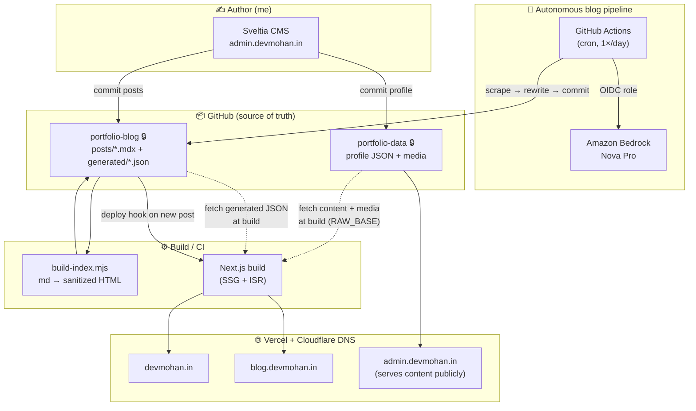
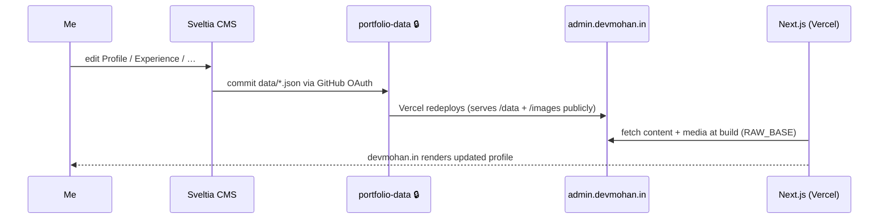
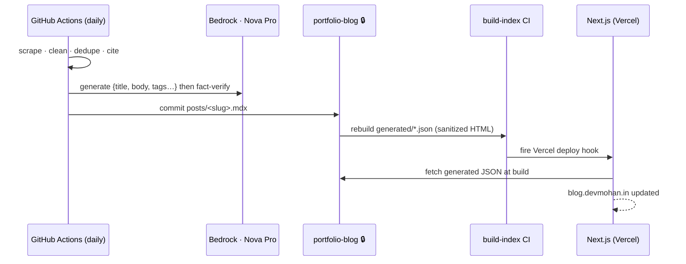

# devmohan.in — Architecture & Tooling

How the whole portfolio is built, hosted, and kept fresh — an autonomous,
AI‑written blog and a git‑based CMS on top of a static Next.js site, with **no
runtime database**.

**Live:**
[devmohan.in](https://devmohan.in) (portfolio) ·
[blog.devmohan.in](https://blog.devmohan.in) (blog) ·
[admin.devmohan.in](https://admin.devmohan.in) (CMS)

---

## System at a glance

**One‑liner:** content lives in two **private** git repos; a static Next.js app
pulls it at build time and serves the portfolio + blog; a git‑based CMS and a
daily AI pipeline are the two ways new content lands in those repos.

---

## Repositories

| Repo | Visibility | Role |
|---|---|---|
| **next-gen-portfolio** | public | The Next.js app — serves `devmohan.in` **and** `blog.devmohan.in` (host‑based routing). |
| **portfolio-data** | 🔒 private | Single source of truth for **profile** content (`data/*.json`, `images/`). Hosts the Sveltia CMS + GitHub OAuth proxy. |
| **portfolio-blog** | 🔒 private | Single source of truth for **blog posts** (`posts/*.mdx`) + precompiled `generated/*.json`. |
| **daily-dev-digest** | 🔒 private | Python pipeline that writes one new blog post per day via Amazon Bedrock. |

> Both content repos are **private**; the app still reads them at build because
> `portfolio-data`'s own Vercel deploy (`admin.devmohan.in`) serves `/data` and
> `/images` publicly, and `portfolio-blog` is read with a build‑time token.

---

## Tech stack & tools

### Frontend / app
- **Next.js 16** (App Router) + **React**
- **Tailwind CSS 3.4** + `@tailwindcss/typography`
- **Middleware** for host‑based subdomain routing (`/` ↔ `/blogs` on the blog host)
- **SSG + ISR** — content fetched at build, revalidated; **no runtime DB**
- `rehype-sanitize` + `rehype-highlight` (highlight.js) for safe post HTML

### Content management (CMS)
- **[Sveltia CMS](https://github.com/sveltia/sveltia-cms)** `0.172.1` — git‑based, drop‑in Decap successor, zero‑backend
- **GitHub OAuth** via a tiny serverless proxy (`api/oauth`, `api/callback`) on Vercel
- Custom `admin/enhance.js` — rebranding, per‑type collections, read‑only preview panes, blog category view, filter/sort, tri‑state select‑all

### Autonomous blog pipeline
- **Python** — scrape → clean → dedupe → cite → generate → verify → export
- **Amazon Bedrock — Nova Pro** (`us.amazon.nova-pro-v1:0`) via the boto3 **Converse API**
- **GitHub Actions** — `cron` 1×/day; authenticates to AWS via **OIDC role assumption** (no long‑lived keys)
- `trafilatura` (extraction) · `difflib` (dedupe)
- `build-index.mjs` — `gray-matter` frontmatter, md → **sanitized, highlighted HTML**, emits `blogs.json` / `search-index.json` / `tags.json`

### Hosting & infra
- **Vercel** — hosts the app (`devmohan.in` + `blog.devmohan.in`) and the CMS/content (`admin.devmohan.in`)
- **Cloudflare** — DNS (CNAMEs → Vercel)
- **GitHub** — repos, Actions CI, OAuth
- **AWS** — Bedrock (Nova Pro); IAM OIDC role, ~\$0.30/mo

---

## Content flow (profile)

## Blog flow (autonomous)

---

## Design principles

- **No runtime database** — everything is static files in git, precompiled at build.
- **Two ways in, one source of truth** — the CMS (human) and the pipeline (AI) both commit to the same private repos.
- **Private by default** — content repos are private; the public surface is only the built site + the CMS's own public asset serving.
- **Fail‑soft builds** — a bad scraped/generated post can't break the app build (validation + precompile happen in the content repo's CI).
